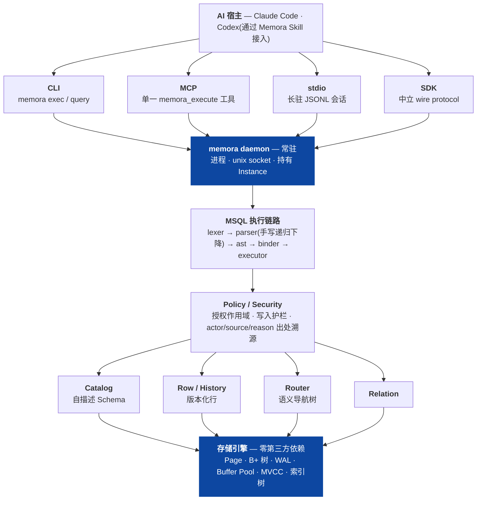
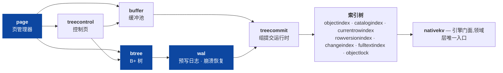
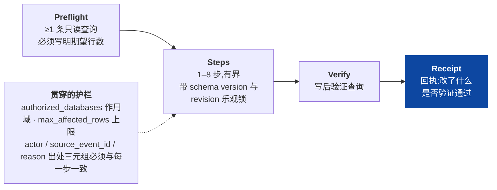

# Memora

[](https://github.com/HW-Yue/Memora/actions/workflows/ci.yml)
[](./go.mod)
[](./LICENSE)

**从零手写的单机数据库引擎,加一层给 AI Agent 用的语义读写协议。**

Memora 是一个本地个人数据库:底层是自研的存储引擎——16 KiB Page、B+ 树、
WAL 与崩溃恢复、Buffer Pool、MVCC,**运行时零第三方依赖**;上层是一套受约束的
SQL 方言(MSQL)和写入协议,让 AI Agent 能自主建模、检索和修改数据,
但**永远碰不到 Page、索引和日志**。

一句话说清它解决什么:*把 AI 的长期记忆放进一个真正的数据库里,而不是放进
一堆 Markdown 文件或者一个向量库。* 数据是结构化、可查询、有版本、能回滚的;
AI 的每一次写入都要先过校验、再验证、留下回执。

| | |
| --- | --- |
| **语言 / 依赖** | Go 1.25,运行时依赖仅 `google/uuid` 与 `golang.org/x/sys` |
| **规模** | 101,269 行生产代码 / 74,278 行测试代码,131 个包 |
| **测试** | 1,380 个测试函数、5 个 fuzz 目标,含断页修复与故障注入 |
| **CI** | 七道门 × 两平台(macOS / Linux):format、vet、lint、unit、race、integration、e2e、交叉编译 |

---

## 一分钟看懂:系统长什么样



**关键约束:Agent 只表达逻辑操作。** Page、索引、MVCC、Undo/Redo 和恢复全部由
引擎自动完成,并且有全仓库范围的 import allowlist 在编译期强制:Agent 相关的包
**不允许**直接引用存储层。

---

## 这个项目里最硬的部分:存储引擎

`internal/store/` —— 14,717 行生产代码 / 16,141 行测试代码,没有第三方依赖。



| 层 | 做了什么 |
| --- | --- |
| **page** | 16 KiB 定长页、Castagnoli CRC32、format version;typed page(Data / BTreeInternal / BTreeLeaf / Free / Manifest / Overflow / TreeControl)。**损坏就明确报错,不假装能恢复。** |
| **treecontrol** | 树的持久状态与可复用页集合(控制页格式 v3),跟着 WAL 的 root 记录一起恢复 |
| **btree** | point / range 查找、split、delete、rebalance、cursor |
| **buffer** | WAL-before-data、young/old 淘汰、脏页按页号升序批量刷出 |
| **wal** | segment 与 ring、durable frontier、checkpoint、reclaim、tree redo、torn-tail 恢复、repair-open |
| **treecommit** | 多棵树在一次提交里原子落盘,durable-then-publish、no-steal |
| **索引树** | Catalog / 当前 Row / Row Version 三类权威索引,Route 与 Fulltext 派生树,COW generation 替换 |

### 崩溃与损坏是被测出来的,不是被声称的

这一层的测试不测 happy path。真实的测试名:

```
TestRecoverFullPageImageRepairsTornPage          断页用全页镜像修复
TestRecoverWriteAndSyncFaultsConvergeOnRetry     写/同步故障注入后重试收敛
TestOpenSegmentSetRepairsSubprocessCrashTail     子进程真崩溃后的 WAL 尾部修复
TestRecoverValidatesWholeTransactionBeforeWrite  写页前先校验整个事务
TestRecoverRejectsDeltaOutsidePage               拒绝越界 redo
TestRecoverSkipsNewerPageLSN                     幂等重放
```

WAL 一个包 73 个测试,B+ 树 57 个。覆盖 corruption、reopen、fault injection、
reference model 与 race —— 这是[项目自己的完成门](./docs/planning/feature-tdd-protocol.md)
里对内核 Feature 的硬性要求。

📎 直接看代码:[`wal/recovery_test.go`](./internal/store/wal/recovery_test.go) ·
[`wal/repair_open_test.go`](./internal/store/wal/repair_open_test.go) ·
[`btree/rebalance.go`](./internal/store/btree/rebalance.go) ·
[`buffer/dirty.go`](./internal/store/buffer/dirty.go)

### 几个具体的性能改动

不是"感觉快了",是定位 → 量化 → 改 → 复测:

| 问题 | 改动 | 结果 |
| --- | --- | --- |
| 开树时 `scanFreePages` 从头读遍整个页文件重建可复用页集合 | 集合是树的状态,写进控制页(格式升到 v3),提交时增量维护 | 1785 页时占开树总耗时 **34%**(1.06s → 0.70s);224 页的树重开从**读 566 页降到读 2 页** |
| 每次 `Begin` 复制整份事务快照 | 改为写时复制 | 每次 Begin **1.81 MB → 96 字节** |
| Buffer Pool 按变脏顺序刷页,而页管理器要求页号升序到达 | 刷脏页按页号升序 | 修掉一个"页文件边长边 checkpoint 就整轮失败"的潜伏 bug |
| Catalog 写路径全表扫描 | 迁入 objects 树 + commit 序号改持久分配器 | 写路径全表扫描清零,并加了**全工作负载零扫描门**防回归 |

### 实测性能

容器化 Linux / Xeon 2.8 GHz(fsync 未必反映真实盘):

| 操作 | 结果 |
| --- | --- |
| 单事务批量写入 500 行 | 84 ms → **168 µs/行** |
| `SELECT ... LIMIT 20` | **< 1 ms** 引擎耗时 |
| 570 行实例磁盘占用 | 556 KB |
| CLI 单次调用固定开销 | ~10 ms(其中约 95% 是进程启动,不是引擎) |

---

## 第二块:MSQL —— 手写的 SQL 方言

`internal/msql/` —— lexer → parser → ast → binder → executor → service → session,
4,685 行,递归下降,**没有用任何 parser generator**。带 fuzz 测试。

和标准 SQL 的关键差别:**Schema 必须自描述**。建库建表时强制声明用途、
适用范围和反范围,列要声明语义角色 —— 因为 Schema 的读者是 AI,不是人。

```sql
CREATE DATABASE life
  PURPOSE 'Personal knowledge'
  SCOPE 'Notes and decisions'
  ANTI SCOPE 'Work material';

CREATE TABLE life.notes
  PURPOSE 'Durable notes'
  SCOPE 'Reviewed knowledge'
  ANTI SCOPE 'Raw documents'
  ROW SEMANTICS 'One reviewed note'
  (
    title   TEXT NOT NULL PURPOSE 'Display title'  ROLE title,
    summary TEXT(1200)    PURPOSE 'Complete note'  ROLE summary
  );
```

这不是语法糖 —— 没有 `PURPOSE` 的 `CREATE` 会被直接拒绝
(`catalog database "life" requires purpose`)。

---

## 第三块:AI 不能裸写数据库

这是整个产品设计里我最想讲的一点。

一个 Agent 直接对生产数据 `UPDATE` 是不可接受的:它可能记错、可能覆盖掉
你三个月前的结论、而且事后你不知道是谁在什么依据下改的。所以 Memora 里
**AI 的每一次写入都必须是一份 Mutation Plan**:



真的能跑 —— 在下面 Quickstart 建好的实例上直接执行:

```bash
memora mutate --data-dir /tmp/demo --plan '{
  "version":"memora.mutation-plan/v1","id":"plan-1","decision":"IGNORE",
  "database":"life","table":"notes","actor":"agent:host",
  "source_event_id":"conversation:event-1",
  "reason":"already captured by an existing Row",
  "authorized_databases":["life"],
  "preflight":[{"id":"duplicate-check",
    "msql":"SELECT row_id FROM life.notes WHERE row_id = :row LIMIT 1",
    "input":{"parameters":{"named":{"row":"row_01"}}},"expect_rows":0}],
  "steps":[],"verify":[]}'
```

```json
{"version":"memora.mutation-receipt/v1","plan_id":"plan-1","decision":"IGNORE",
 "status":"ignored","changes":[],"ignored":1,"verified":true,"warnings":[]}
```

`IGNORE`(判定"这条信息已经存在,不写")在这里是**一等公民决策**,
和 `INSERT` / `REVISE` / `MERGE` / `SPLIT` / `MOVE` / `RELATE` 并列 ——
让 AI 显式地决定"不写",比让它默认写入安全得多。

📎 [`internal/skillwrite/policy.go`](./internal/skillwrite/policy.go)(校验规则)·
[`skills/memora/SKILL.md`](./skills/memora/SKILL.md)(Agent 面向的完整协议)

---

## Quickstart

```bash
go build -o memora ./cmd/memora

./memora init --data-dir /tmp/demo
./memora daemon start --data-dir /tmp/demo
```

建一个自描述的库和表:

```bash
./memora exec --data-dir /tmp/demo \
  "CREATE DATABASE life PURPOSE 'Personal knowledge' \
   SCOPE 'Notes and decisions' ANTI SCOPE 'Work material'"

./memora exec --data-dir /tmp/demo \
  "CREATE TABLE life.notes PURPOSE 'Durable notes' SCOPE 'Reviewed knowledge' \
   ANTI SCOPE 'Raw documents' ROW SEMANTICS 'One reviewed note' \
   (title TEXT NOT NULL PURPOSE 'Display title' ROLE title, \
    summary TEXT(1200) PURPOSE 'Complete note' ROLE summary)"
```

查询:

```bash
./memora query --data-dir /tmp/demo "SHOW TABLES FROM life"
./memora query --data-dir /tmp/demo "DESCRIBE TABLE life.notes"
./memora query --data-dir /tmp/demo "SELECT title FROM life.notes LIMIT 5"
```

所有结果都是稳定的 `memora.result/v1` 信封(JSON),给 Agent 和给人是同一份。

看一眼库里发生了什么:

```bash
./memora admin --data-dir /tmp/demo   # 127.0.0.1:3888 本地只读观察界面
./memora daemon stop --data-dir /tmp/demo
```

其他入口:`memora mcp`(MCP,单一 `memora_execute` 工具)、
`memora --stdio`(长驻 JSONL 会话)、`memora doctor`、`memora upgrade`。
`memora help` 有完整列表。

---

## 工程实践

这部分和代码本身同等重要,单独拿出来说。

### CI:七道门,两个平台

[`scripts/ci.sh`](./scripts/ci.sh) —— 本地和 CI 跑的是同一个脚本。

```
format         gofmt
vet            go vet,GOOS=linux 和 GOOS=darwin 各扫一遍
lint           staticcheck + errcheck + ineffassign,版本钉死,同样双平台
unit           go test ./...
race           go test -race ./...
integration    go test -tags=integration ./...
e2e            go test -tags=e2e ./...
cross-build    darwin/arm64 + darwin/amd64 交叉编译
```

两个刻意的设计,都是被真实事故逼出来的(脚本注释里写明了):

- **vet / lint 按 GOOS 各扫一遍**,而不是只扫跑 CI 的那台机器 ——
  `//go:build darwin` 后面的文件对 Linux 扫描是隐形的,曾经有两个
  `_darwin.go` 的问题就是这样躲过本地检查、在 CI 才炸的。
- **lint 工具链版本钉死到 go.mod 的版本**,并且**不 export** ——
  export 会漏进 `go test`,让测试的子进程去下载 toolchain,走上它绝对不能走的路径。
  这个 pin 前后坏过两次,注释里都记着。

没有 baseline、没有豁免文件:引入这道门的时候把所有告警都修了,所以现在报出来的一定是新的。

### 发布:签名 tag 才能触发

[`.github/workflows/release.yml`](./.github/workflows/release.yml) ——
所有 action 按 commit SHA 钉死。只有**验证过签名的** annotated `vX.Y.Z` tag 能触发;
先跑完整测试,在 arm64 与 amd64 runner 上分别做原生冒烟、并完成"从零到第一条记忆"
的验收之后,才上传二进制、checksum、manifest 和 Skill bundle。普通 PR 没有发布权限。
制品由确定性 Builder 生成,要求 tracked worktree 干净。

### 文档:带行号的风险台账

[`docs/development/known-risks.md`](./docs/development/known-risks.md)
记录**已确认存在但还没修**的问题,每条给 `文件:行` 和判断依据,不写推测,
并且明确区分"实现漂移"和"评估后的有意选择"。
[架构审计](./docs/development/architecture-audit-2026-08.md)是某一时点的实测清单,
缺陷、耦合、重复逐条列出,每条带调用方计数。

被取代的设计不删除,标注"已被取代"并链到当前设计 —— 这样读旧代码的人不会被旧文档骗。

---

## 项目状态与已知边界

写在这里而不是藏起来:

**成熟(有测试、当前无已知缺陷)**
- 存储引擎:Page / WAL / B+ 树 / Buffer Pool / MVCC / 索引 / COW generation 替换
- MSQL:词法、语法、绑定、执行、会话、多语句真原子事务、中立 wire protocol
- 安装、daemon、格式升级、诊断、确定性发布链路

**已交付但质量未验证**
- 语义 Router 与检索的实际效果(机制完成,召回质量缺真实评测证据)
- 资料吸收(PDF / EPUB / DOCX → 语义模块)

**明确未完成**
- Query Agent 目前只有一步记忆,多跳导航在结构上还做不到
  ——[已知风险 #1](./docs/development/known-risks.md),这是当前最优先的缺口
- `internal/` 里 `native*` 与非 `native*` 存在成对的包,是一次尚未收尾的迁移
- 还没有打过正式 release tag

完整清单:[当前系统能力](./docs/product/system-capabilities.md) ·
[已知风险](./docs/development/known-risks.md) ·
[路线 v3](./docs/planning/roadmap-v3.md)

---

## 文档导航

`docs/` 下 271 篇当前文档 + 145 篇归档。**不要从头读**,入口是
[`docs/README.md`](./docs/README.md)。三份最高参考规范:

1. [写入形态](./docs/product/write-model.md) —— 数据怎么落库
2. [查询形态](./docs/product/query-model.md) —— 数据怎么被找到
3. [架构原则](./docs/product/architecture-principles.md) —— 代码怎么组织(每条带"怎么算违反"的判据)

---

## 关于 AI 协作

> **这个项目是我与 AI 编码工具协作完成的,git 历史里的 author 是工具本身,
> 我在这里说明清楚,而不是让你自己去猜。**
>
> 我负责的是:架构与数据结构选型、写入与查询形态的规格、每一项 Feature 的
> 拆分与验收标准、TDD 完成门的定义、以及所有技术裁定(哪条路走、哪条路砍掉、
> 哪个缺陷是有意选择而不是遗留)。AI 负责在这些约束下实现与重构。
>
> 如果你想看我的判断而不是生成的代码,直接读这几份 ——
> [架构原则](./docs/product/architecture-principles.md)(每条带判据和已知违例)、
> [已知风险](./docs/development/known-risks.md)(带行号,含明确标注为"有意选择"的条目)、
> [TDD 协议](./docs/planning/feature-tdd-protocol.md)、
> 以及 [`scripts/ci.sh`](./scripts/ci.sh) 的注释。
> 那些是设计决策,不是代码生成的产物。

---

## 本地验证

```bash
go build ./...
go test ./...          # 115 个包
./scripts/ci.sh        # 全部七道门
./scripts/ci.sh --stage race
```

## 许可

个人学习、研究、娱乐和其他非商业用途可依据
[PolyForm Noncommercial 1.0.0](./LICENSE) 免费使用、修改和分发。
商业用途需事先取得书面付费商业许可证,见[商业授权说明](./COMMERCIAL-LICENSE.md)。
因此本项目是 source-available,不是 OSI 定义的开源软件。
